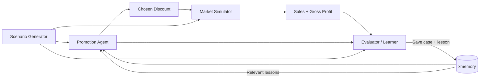

# Hacker Sprint 2 — Self-Learning FMCG Promotion Agent

An autonomous promotion agent that improves its discount decisions from outcomes stored in persistent memory.

## Core loop

**Scenario → Agent → Simulator → Evaluator → xmemory → better next decision**

The demo is intentionally small: the agent chooses one of `0%`, `10%`, `20%`, or `30%` discount levels. A simulator produces sales and gross profit. An evaluator replays all allowed actions, calculates regret, and writes reusable lessons to xmemory. Future decisions retrieve those lessons.

## Interactive learning loop

The interactive animation lives in [`docs/`](docs/) and is intended to be published with GitHub Pages.

Once Pages is enabled for `/docs`, the demo will show two rounds:

1. **Cold memory** — the agent chooses a suboptimal discount.
2. **Learning** — the evaluator finds the optimal action and stores a lesson.
3. **Warm memory** — the next similar case retrieves that lesson and changes the agent's choice.

## MVP architecture

## Evaluation

Keep everything constant except memory:

- same model
- same prompt
- same simulator
- same fixed test scenarios

Compare:

- optimal action rate
- average regret
- gross profit
- memory retrieval hit rate

The hackathon claim should be simple: **same agent, better decisions because accumulated memory changes its behavior.**
