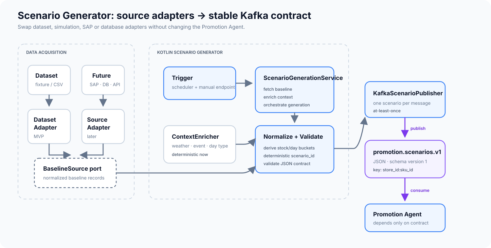
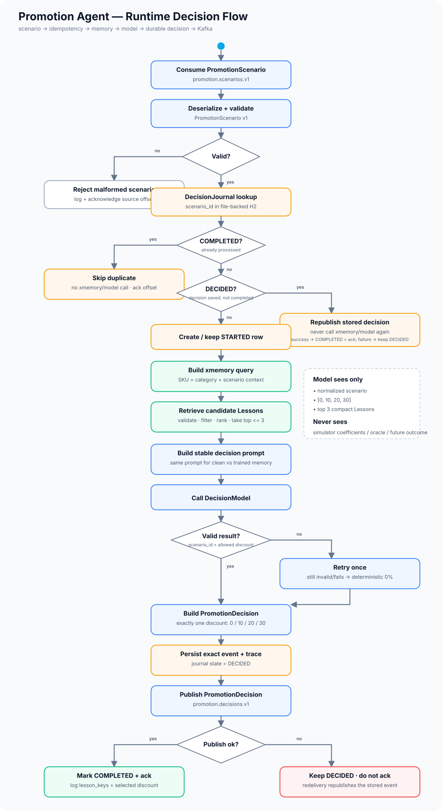
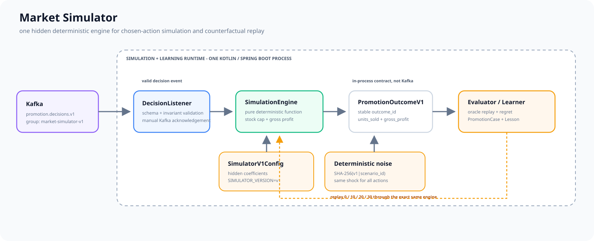
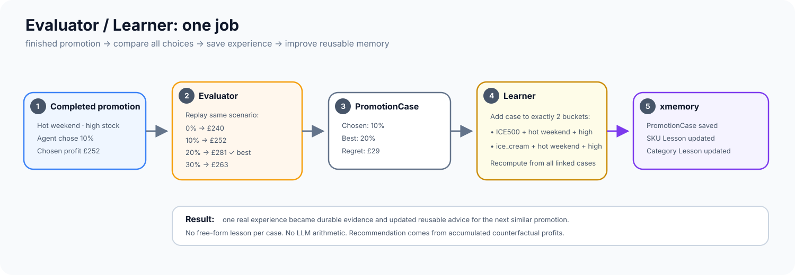
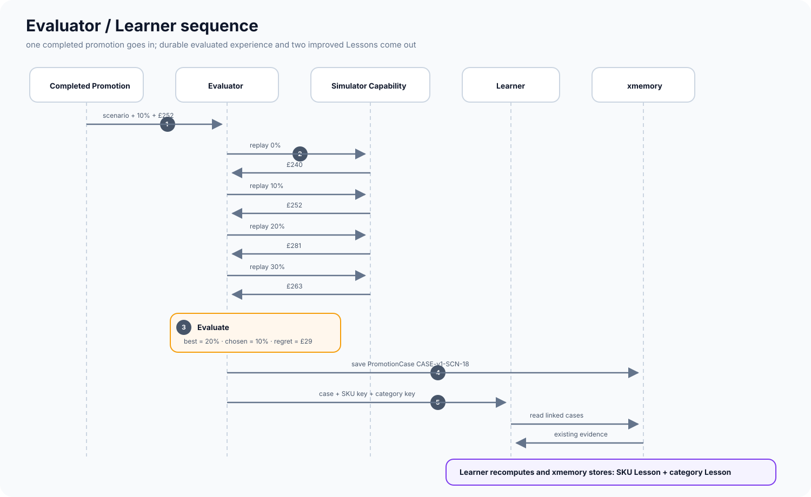
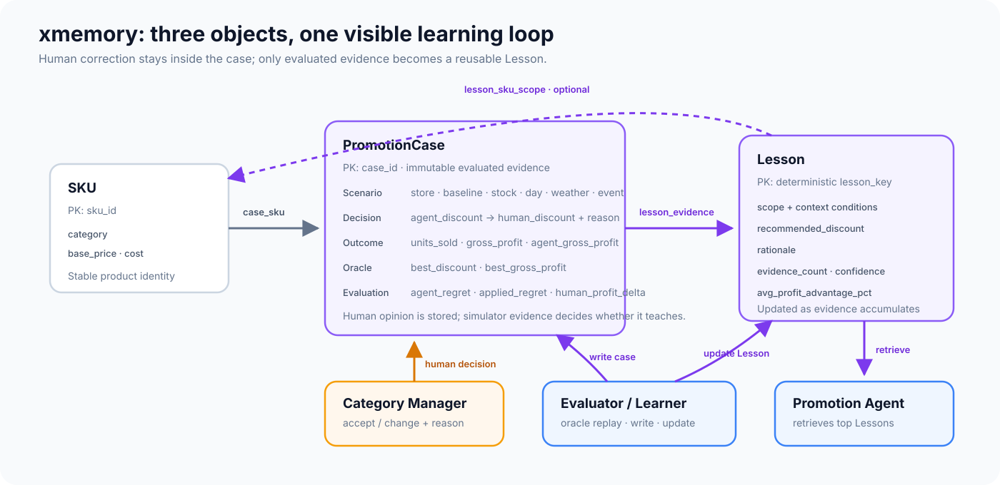
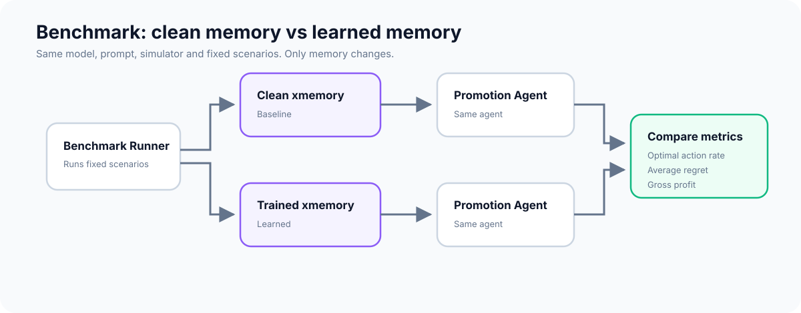

# Hacker Sprint 2 — Self-Learning FMCG Promotion Agent

An autonomous promotion agent that improves its discount decisions from outcomes stored in persistent memory.

## Self-learning loop



The demo is intentionally small: the agent chooses one of `0%`, `10%`, `20%`, or `30%` discount levels. A simulator produces sales and gross profit. An evaluator replays all allowed actions, calculates regret, and writes evaluated evidence. A learner turns accumulated evidence into reusable lessons in xmemory. Future decisions retrieve those lessons.

The core behavior is:

**scenario → decision → simulated outcome → PromotionCase → Lesson → lesson read → changed next decision**

## MVP architecture


The architecture is intentionally small:

- **Scenario Generator** fetches baseline market data through a source adapter, normalizes it, and publishes scenario events to Kafka.
- **Kafka** topic `promotion.scenarios.v1` decouples data collection/scheduling from decision logic.
- **Promotion Agent** consumes scenarios, reads a few relevant lessons from **xmemory**, chooses one discount, and journals the exact decision durably for idempotency and traceability.
- **Kafka** topic `promotion.decisions.v1` carries the validated decision plus scenario snapshot to the simulator.
- **Market Simulator** applies a hidden deterministic market model and produces one versioned `PromotionOutcomeV1` containing the chosen-action business result.
- **Evaluator** replays all four discounts through the same pure simulator capability, chooses the oracle-best action, calculates regret, and creates one immutable **PromotionCase**.
- **Learner** assigns each case to exactly two deterministic Lesson buckets, recomputes aggregate evidence, and creates or updates reusable **Lessons**.
- **xmemory** persists SKU, PromotionCases, Lessons, and evidence relations across restarts.

The important property is:

**market data → scenario → memory-backed decision → outcome → evaluated case → reusable lesson → better next decision**

Kafka remains limited to two meaningful external boundaries. Market Simulator, Evaluator, and Learner share one deployable Kotlin/Spring Boot runtime for the MVP but remain separate logical components. One JVM is a deployment choice, not a philosophical union of unrelated responsibilities.

- Architecture notes: [`docs/architecture/README.md`](docs/architecture/README.md)
- Editable diagram source: [`docs/architecture/high-level-architecture.mmd`](docs/architecture/high-level-architecture.mmd)

## Component deep dives

### Scenario Generator



The Scenario Generator is a Kotlin microservice and the ingestion boundary of the system:

- source adapters hide whether baseline data comes from a fixture, SAP, database, or API;
- a scheduler or manual trigger starts scenario generation;
- context enrichment adds normalized weather/event/day context;
- the service publishes one validated immutable event to `promotion.scenarios.v1` per scenario;
- the Promotion Agent depends only on the versioned event contract, never source-specific DTOs.

For the hackathon the market is fixed to **London Central** (`LONDON_CENTRAL`, `Europe/London`) and the primary baseline source is a small fixture prepared offline from **dunnhumby Breakfast at the Frat**. The raw public dataset never becomes a runtime dependency.

- Detailed design: [`docs/scenario-generator/README.md`](docs/scenario-generator/README.md)
- Dataset preparation: [`docs/scenario-generator/dataset-preparation.md`](docs/scenario-generator/dataset-preparation.md)
- Baseline fixture example: [`docs/scenario-generator/baseline-fixture.example.csv`](docs/scenario-generator/baseline-fixture.example.csv)
- Kafka JSON Schema: [`docs/scenario-generator/promotion-scenario-v1.schema.json`](docs/scenario-generator/promotion-scenario-v1.schema.json)
- Example event: [`docs/scenario-generator/promotion-scenario-v1.example.json`](docs/scenario-generator/promotion-scenario-v1.example.json)
- Editable diagram source: [`docs/scenario-generator/architecture.mmd`](docs/scenario-generator/architecture.mmd)

### Promotion Agent



The Promotion Agent is also a Kotlin/Spring Boot service for the MVP. Its runtime flow is explicit:

- consume and validate `promotion.scenarios.v1`;
- use `scenario_id` as the durable idempotency key in the H2 `DecisionJournal`;
- retrieve candidate Lessons from xmemory and deterministically keep at most `3` relevant Lessons;
- build the same decision prompt for clean-memory and trained-memory runs;
- ask the model for exactly one action from `0 | 10 | 20 | 30`;
- validate the model result, retry once, then fall back to deterministic `0%` if necessary;
- persist the exact decision payload as `DECIDED` before publishing it;
- publish `promotion.decisions.v1`;
- mark the journal `COMPLETED` and acknowledge the source offset only after publish succeeds.

On restart, a `DECIDED` scenario republishes the already persisted decision instead of calling xmemory or the model again. A `COMPLETED` scenario is acknowledged as a duplicate.

Operational idempotency/trace data stays in the agent's H2 journal, not in xmemory. xmemory remains product learning memory containing only SKU, PromotionCase, and Lesson.

- Runtime flow explanation: [`docs/promotion-agent/FLOW.md`](docs/promotion-agent/FLOW.md)
- PlantUML runtime flow source: [`docs/promotion-agent/flow.puml`](docs/promotion-agent/flow.puml)
- Detailed design: [`docs/promotion-agent/README.md`](docs/promotion-agent/README.md)
- Component/topology source: [`docs/promotion-agent/architecture.mmd`](docs/promotion-agent/architecture.mmd)
- Kafka JSON Schema: [`docs/promotion-agent/promotion-decision-v1.schema.json`](docs/promotion-agent/promotion-decision-v1.schema.json)
- Example event: [`docs/promotion-agent/promotion-decision-v1.example.json`](docs/promotion-agent/promotion-decision-v1.example.json)

### Market Simulator



The Market Simulator is only the hidden market world:

- consume and validate `promotion.decisions.v1` using consumer group `market-simulator-v1`;
- run a pure deterministic `SimulationEngine`;
- apply category/context demand factors plus context-sensitive promotion elasticity;
- cap units by exact stock and calculate gross profit with fixed rounding rules;
- use a small deterministic SHA-256 scenario shock;
- produce one versioned `PromotionOutcomeV1` containing `units_sold` and `gross_profit`.

**Its scope ends at `PromotionOutcomeV1`.** It does not calculate oracle actions or regret, create PromotionCases, update Lessons, or write xmemory.

The same pure simulation capability is called by the Evaluator for counterfactual actions, but replay orchestration belongs to the Evaluator. Hidden coefficients and noise internals never enter the Promotion Agent prompt or xmemory.

- Detailed design: [`docs/market-simulator/README.md`](docs/market-simulator/README.md)
- Editable diagram source: [`docs/market-simulator/architecture.mmd`](docs/market-simulator/architecture.mmd)
- Outcome JSON Schema: [`docs/market-simulator/promotion-outcome-v1.schema.json`](docs/market-simulator/promotion-outcome-v1.schema.json)
- Example outcome: [`docs/market-simulator/promotion-outcome-v1.example.json`](docs/market-simulator/promotion-outcome-v1.example.json)

### Evaluator / Learner



This component has one job:

**take one finished promotion → compare all four discounts → save one evaluated PromotionCase → improve two reusable Lessons.**

Tiny example:

```text
Agent chose 10% -> £252

Replay:
0%  -> £240
10% -> £252
20% -> £281  <- best
30% -> £263

Regret = £29
```

That becomes one immutable PromotionCase. The case then updates exactly two Lesson buckets: one for the exact SKU and one for its category. Each Lesson is recomputed from all linked PromotionCases, so new evidence can strengthen or even change the recommendation.

No LLM does arithmetic or chooses the Lesson recommendation.



- Detailed design and examples: [`docs/evaluator-learner/README.md`](docs/evaluator-learner/README.md)
- Overview diagram source: [`docs/evaluator-learner/architecture.mmd`](docs/evaluator-learner/architecture.mmd)
- Sequence diagram source: [`docs/evaluator-learner/sequence.mmd`](docs/evaluator-learner/sequence.mmd)

### xmemory



The MVP memory schema contains only three domain objects:

- **SKU** — stable product identity and basic economics.
- **PromotionCase** — immutable evaluated evidence: scenario, chosen discount, outcome, all four replay profits, simulator optimum, and regret.
- **Lesson** — compact reusable knowledge recomputed from linked cases and retrieved before later decisions.

Each Lesson links back to the PromotionCases that produced it, making the hackathon write → read → changed-behaviour trace visible and reproducible.

- Detailed design: [`docs/xmemory/README.md`](docs/xmemory/README.md)
- XMD v1 schema: [`docs/xmemory/schema.xmd.yaml`](docs/xmemory/schema.xmd.yaml)
- Editable diagram source: [`docs/xmemory/schema.mmd`](docs/xmemory/schema.mmd)

## Benchmark



To prove self-improvement, the Benchmark Runner compares the same agent with:

- **clean xmemory**;
- **trained xmemory**.

Everything else stays constant:

- same model;
- same prompt;
- same simulator version and configuration;
- same fixed scenarios and scenario IDs.

Training uses roughly `200-300` scenarios with `LEARNING_ENABLED=true`. The benchmark uses `50` fixed scenarios with `LEARNING_ENABLED=false` for both clean and trained memory, so measurement itself cannot create new Lessons.

Compare:

- optimal action rate;
- average regret;
- gross profit.

- Benchmark notes: [`docs/benchmark/README.md`](docs/benchmark/README.md)
- Editable diagram source: [`docs/benchmark/benchmark.mmd`](docs/benchmark/benchmark.mmd)

The hackathon claim should be simple: **same agent, better decisions because accumulated memory changes its behavior.**
