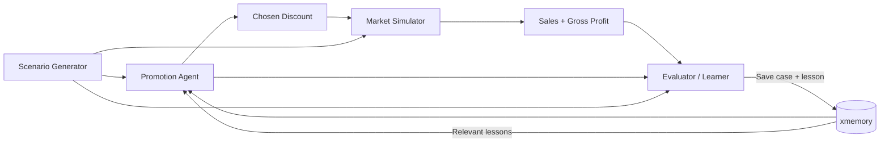

# Hacker Sprint 2 — Self-Learning FMCG Promotion Agent

An autonomous promotion agent that improves its discount decisions from outcomes stored in persistent memory.

## Self-learning loop

The demo is intentionally small: the agent chooses one of `0%`, `10%`, `20%`, or `30%` discount levels. A simulator produces sales and gross profit. An evaluator replays all allowed actions, calculates regret, and writes reusable lessons to xmemory. Future decisions retrieve those lessons.

The core behavior is:

**scenario → decision → simulated outcome → counterfactual evaluation → lesson write → lesson read → changed next decision**

## MVP architecture

## Evaluation

Keep everything constant except memory:

- same model
- same prompt
- same simulator
- same fixed test scenarios

Compare:

- optimal action rate
- average regret
- gross profit
- memory retrieval hit rate

The hackathon claim should be simple: **same agent, better decisions because accumulated memory changes its behavior.**
