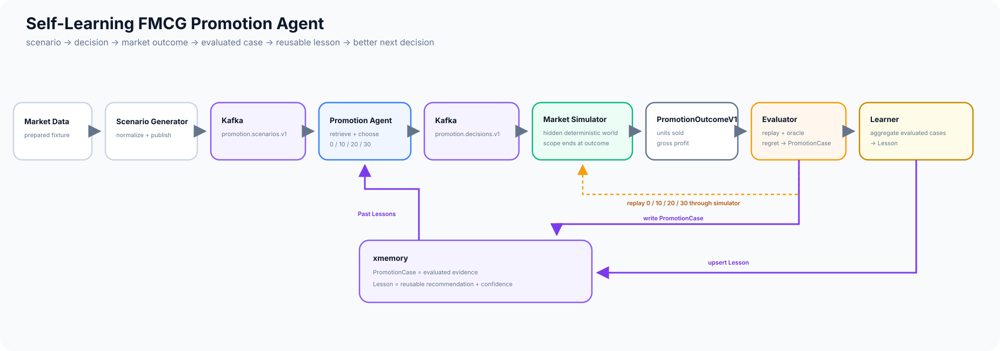

# High-Level Architecture

This diagram shows the logical service boundaries, persistent storage, and the main learning and benchmark flows. The MVP can still run as one application process; these are responsibility boundaries, not required deployment boundaries.

Editable source: [`high-level-architecture.mmd`](high-level-architecture.mmd)

## Reading the diagram

- **Scenario Generator** owns scenario construction, not promotion decisions.
- **Promotion Agent** reads xmemory before choosing one allowed discount.
- **Market Simulator** is the hidden external world and produces objective outcomes.
- **Evaluator / Learner** computes counterfactual regret and turns results into durable experience.
- **xmemory** persists completed cases and reusable lessons across runs.
- **Benchmark Runner** holds the model, prompt, simulator, and test scenarios constant while comparing clean versus trained memory.

The important feedback path is:

`Scenario -> Memory Read -> Decision -> Simulation -> Evaluation -> Memory Write -> Next Scenario`
