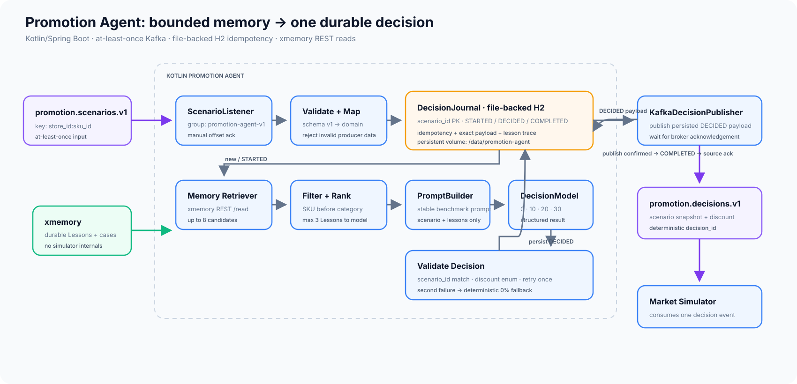

# Promotion Agent

The Promotion Agent is the decision boundary of the system. It consumes one validated `PromotionScenario`, retrieves a small amount of durable experience from xmemory, asks the decision model for exactly one allowed discount, validates the result, and publishes one immutable `PromotionDecision` for the Market Simulator.



Editable diagram source: [`architecture.mmd`](architecture.mmd)  
Kafka decision contract: [`promotion-decision-v1.schema.json`](promotion-decision-v1.schema.json)  
Example decision event: [`promotion-decision-v1.example.json`](promotion-decision-v1.example.json)

## Design goal

Keep this runtime path small and reproducible:

```text
promotion.scenarios.v1
        |
        v
Promotion Agent
  - durable duplicate check
  - read relevant xmemory Lessons
  - build stable model input
  - choose 0 / 10 / 20 / 30
  - validate
        |
        v
promotion.decisions.v1
        |
        v
Market Simulator
```

The important experiment is not whether an LLM can invent a plausible promotion. It is whether the **same model and same prompt** make better decisions when useful Lessons exist in durable memory.

The Promotion Agent must therefore keep memory retrieval explicit, bounded, observable, and separate from the model itself.

## Runtime choice

Use **Kotlin + Spring Boot** for the MVP, matching the Scenario Generator.

Recommended dependencies:

- Spring Kafka
- Jackson
- JSON Schema validator
- Spring JDBC
- H2 in file mode
- Spring `RestClient` or `WebClient` for xmemory and the model provider

A separate Python service is not justified for the first version. xmemory exposes a normal REST API, so Kotlin does not need a special xmemory SDK. The model integration also sits behind one small port.

If a later experiment genuinely needs a Python-only agent framework, the boundary can move without changing Kafka contracts. For the hackathon, another runtime would mostly create another Dockerfile to become emotionally attached to.

## Internal architecture

Use a small ports-and-adapters structure.

### 1. `ScenarioListener`

Consumes:

```text
promotion.scenarios.v1
```

Recommended consumer group:

```text
promotion-agent-v1
```

MVP settings:

- one record at a time;
- consumer concurrency `1`;
- manual offset acknowledgement;
- JSON is received as bytes/string first, then schema-validated, then mapped to the domain model;
- do not rely on Kafka deserialization exceptions as business validation.

The listener should do almost no business work itself. It calls `PromotionDecisionService` and acknowledges the Kafka offset only after the decision workflow reaches a durable terminal state.

### 2. `DecisionJournal`

Kafka input is at-least-once, so `scenario_id` is the idempotency key.

Do **not** put operational idempotency state into xmemory. xmemory is product memory; Kafka delivery bookkeeping is not a fourth secret domain object pretending to be knowledge.

Use one file-backed H2 database for the single Promotion Agent instance:

```text
/data/promotion-agent/agent-db
```

Mount `/data/promotion-agent` as a persistent Docker volume.

Conceptual port:

```kotlin
interface DecisionJournal {
    fun find(scenarioId: String): DecisionExecution?
    fun markStarted(scenarioId: String, decisionId: String)
    fun saveDecided(execution: DecisionExecution)
    fun markCompleted(scenarioId: String, completedAt: Instant)
}
```

One table is enough:

```text
decision_execution
------------------
scenario_id                 PK
decision_id                 UNIQUE
status                      STARTED | DECIDED | COMPLETED
decision_payload_json       nullable until DECIDED
selected_discount           nullable until DECIDED
retrieved_lessons_json      nullable
memory_status               ok | empty | unavailable | invalid_response
model_id                    nullable
model_reason                nullable
decision_source             model | fallback
started_at
decided_at
completed_at
```

This table serves two jobs that naturally belong together for the MVP:

1. durable duplicate handling;
2. durable observability for the write -> read -> changed-decision demo.

It is **not** learning memory. Clearing xmemory and clearing this operational journal are different actions.

### Idempotency flow

For an incoming `scenario_id`:

```text
no row / STARTED
    -> make decision
    -> persist exact decision event as DECIDED
    -> publish
    -> mark COMPLETED
    -> acknowledge Kafka offset

DECIDED
    -> republish the already persisted decision event
    -> mark COMPLETED
    -> acknowledge offset

COMPLETED
    -> do not call xmemory
    -> do not call model
    -> acknowledge offset
```

Use a deterministic decision id:

```text
DEC-<scenario_id>
```

Example:

```text
SCN-20260718-LONDON_CENTRAL-ICE500
-> DEC-SCN-20260718-LONDON_CENTRAL-ICE500
```

There is one unavoidable crash window without Kafka transactions/outbox machinery:

```text
publish succeeds
process crashes before markCompleted()
```

Kafka can then redeliver the scenario and the agent may publish the same decision again. This is acceptable for the MVP because `decision_id` is deterministic. The Market Simulator should also treat `decision_id` as an idempotency key.

Do not build distributed exactly-once processing. The duplicate is deterministic and harmless when downstream honors the key.

## xmemory retrieval

The model never gets the whole memory instance.

The Promotion Agent first asks xmemory for candidate Lessons, then application code filters/ranks them deterministically, and only the top `3` go into the model input.

### Application port

```kotlin
interface PromotionMemory {
    fun findRelevantLessons(scenario: PromotionScenario): List<LessonSnapshot>
    fun findSupportingCases(lessonKey: String, limit: Int = 2): List<PromotionCaseSnapshot>
}
```

MVP implementation:

```text
XmemoryPromotionMemory
```

### Exact xmemory read API

Use the documented REST read endpoint:

```text
POST https://api.xmemory.ai/instances/{instance_id}/read
Authorization: Bearer <XMEM_API_KEY>
Content-Type: application/json
```

Official API documentation: <https://xmemory.ai/api/>

For the first candidate read, do not use xmemory `scope`: at this point the agent does not yet know the primary keys of the relevant Lesson objects. Ask xmemory to search the instance and return stored Lesson candidates as structured objects.

Example request:

```json
{
  "query": "Return up to 8 stored Lesson objects relevant to sku ICE500, category ice_cream, store London Central, weekend, hot weather, local_event, high stock. Only return lessons whose scope is sku:ICE500 or category:ice_cream. A lesson condition that is present must match the scenario. Prefer relevant stored lessons; do not invent a new lesson or recommendation.",
  "mode": "xresponse",
  "return_sql": false,
  "skip_suggestion_capture": true,
  "trace_id": "SCN-20260718-LONDON_CENTRAL-ICE500",
  "session_id": "promotion-agent"
}
```

Use `skip_suggestion_capture=true` for runtime decision reads so benchmark traffic does not create schema-suggestion side effects.

The raw HTTP response is an xmemory envelope. Read the first successful item's `reader_result`, then map only stored `Lesson` objects to `LessonSnapshot`.

Do not send raw xmemory response prose to the model.

### Deterministic candidate filtering

After xmemory returns candidates, application code applies these rules:

1. accept only `scope=sku:<current sku>` or `scope=category:<current category>`;
2. reject a non-empty `store_scope` that does not match the current store;
3. every non-empty condition must match the scenario:
   - `day_type`
   - `weather`
   - `event_type`
   - `stock_level`
4. rank exact SKU scope before category scope;
5. within the same scope, sort by:
   - `confidence` descending;
   - `evidence_count` descending;
   - `avg_profit_advantage_pct` descending, null last;
   - `lesson_key` ascending for deterministic tie-breaking;
6. take at most `3`.

This gives xmemory responsibility for durable semantic retrieval while application code keeps final eligibility predictable and testable.

### Supporting PromotionCases

Supporting cases are optional and **disabled by default** for the decision path. Lessons should normally contain enough aggregate evidence.

For a demo explanation or diagnostic mode, fetch up to `2` cases for a selected Lesson using a scoped read after its `lesson_key` is known:

```json
{
  "query": "Return up to 2 PromotionCase objects linked to this Lesson through lesson_evidence. Prefer the strongest recent evidence. Return stored cases only.",
  "mode": "xresponse",
  "scope": {
    "objects": [
      {
        "type": "Lesson",
        "key": {
          "lesson_key": "category:ice_cream|store:any|weekend|hot|event:any|stock:high"
        }
      }
    ],
    "relations_scope": "all_relations"
  },
  "return_sql": false,
  "skip_suggestion_capture": true,
  "trace_id": "SCN-20260718-LONDON_CENTRAL-ICE500",
  "session_id": "promotion-agent"
}
```

The normal model decision should not need this second call.

## Model input contract

The model receives only three things:

1. normalized scenario;
2. allowed discounts `[0, 10, 20, 30]`;
3. at most `3` compact Lesson snapshots.

Conceptual input:

```json
{
  "scenario": {
    "date": "2026-07-18",
    "store_id": "LONDON_CENTRAL",
    "sku_id": "ICE500",
    "sku_name": "Ice Cream 500ml",
    "category": "ice_cream",
    "price": 5.0,
    "cost": 3.0,
    "stock": 320,
    "baseline_sales": 100,
    "stock_level": "high",
    "day_type": "weekend",
    "weather": "hot",
    "temperature_c": 31.0,
    "event_type": "local_event",
    "event_note": "concert_nearby"
  },
  "allowed_discounts": [0, 10, 20, 30],
  "lessons": [
    {
      "lesson_key": "category:ice_cream|store:any|weekend|hot|event:any|stock:high",
      "scope": "category:ice_cream",
      "recommended_discount": 20,
      "confidence": 0.82,
      "evidence_count": 7,
      "avg_profit_advantage_pct": 9.3,
      "rationale": "Hot weekends with high stock favored 20%; 30% usually lost too much margin."
    }
  ]
}
```

The model must **not** receive:

- simulator coefficients;
- oracle best action;
- future outcome;
- noise seeds;
- benchmark expected answer;
- unrestricted xmemory dumps;
- hidden counterfactual profits from the current scenario.

Historical Lesson evidence is allowed because that is the point of the memory experiment.

## Stable prompt

Keep the system prompt versioned and unchanged between clean-memory and trained-memory benchmark runs.

Recommended intent:

```text
You are a promotion decision agent.
Choose exactly one discount from 0, 10, 20, 30 to maximize expected gross profit.
Use only the supplied scenario and retrieved lessons.
Lessons are evidence, not mandatory rules; prefer stronger and more relevant evidence.
Do not assume access to simulator internals or future outcomes.
Return only the required structured result.
```

Clean-memory benchmark input uses exactly the same prompt with:

```json
"lessons": []
```

Do not add phrases such as "there is no memory" to the clean run. That would make the prompt itself different and contaminate the comparison.

## Model output contract

The model response is an **internal agent contract**, not the Kafka contract.

Use structured output / JSON Schema support from the selected model provider when available.

Required shape:

```json
{
  "scenario_id": "SCN-20260718-LONDON_CENTRAL-ICE500",
  "discount": 20,
  "reason": "A strong matching lesson favors 20% while preserving more margin than 30%."
}
```

Validation rules:

- returned `scenario_id` must equal the input `scenario_id`;
- `discount` must be exactly one of `0 | 10 | 20 | 30`;
- `reason` is short observability text only;
- no additional model fields are trusted.

`reason` is stored in the local DecisionJournal for demo/debugging. It is not required by the Market Simulator and is deliberately omitted from the Kafka business event.

## Decision model port

```kotlin
interface DecisionModel {
    fun decide(input: DecisionModelInput): ModelDecision
}
```

The application service should not depend on a provider SDK directly. A provider change must not alter Kafka, xmemory, or benchmark contracts.

## Output transport

Use Kafka for one more **external component boundary**:

```text
Promotion Agent
      |
      v
promotion.decisions.v1
      |
      v
Market Simulator
```

This topic is worth having because:

- the scenario side is already asynchronous;
- decisions become replayable and observable;
- simulator execution is decoupled from model latency;
- benchmark tooling can replay recorded decisions;
- the Market Simulator remains a simple consumer.

Do not Kafka internal memory calls, prompt construction, evaluator arithmetic, or every function that happens to have a noun.

### Topic

```text
promotion.decisions.v1
```

### Kafka key

Keep the same partitioning key as the source scenario:

```text
<store_id>:<sku_id>
```

Example:

```text
LONDON_CENTRAL:ICE500
```

### Decision event

The Kafka event carries the normalized scenario snapshot forward unchanged plus the chosen discount:

```json
{
  "event_type": "promotion.decision.created",
  "schema_version": 1,
  "decision_id": "DEC-SCN-20260718-LONDON_CENTRAL-ICE500",
  "scenario_id": "SCN-20260718-LONDON_CENTRAL-ICE500",
  "decided_at": "2026-07-18T06:00:01Z",
  "scenario": {
    "date": "2026-07-18",
    "store_id": "LONDON_CENTRAL",
    "store_name": "London Central",
    "sku_id": "ICE500",
    "sku_name": "Ice Cream 500ml",
    "category": "ice_cream",
    "price": 5.0,
    "cost": 3.0,
    "stock": 320,
    "baseline_sales": 100,
    "stock_level": "high",
    "day_type": "weekend",
    "weather": "hot",
    "temperature_c": 31.0,
    "event_type": "local_event",
    "event_note": "concert_nearby"
  },
  "decision": {
    "discount": 20
  }
}
```

Passing the scenario snapshot avoids forcing the Market Simulator to consume two topics and join by `scenario_id`. The snapshot must be copied from the validated input event, not regenerated by the Promotion Agent.

The contract is defined in [`promotion-decision-v1.schema.json`](promotion-decision-v1.schema.json).

## Offset commit policy

For a normal new scenario:

1. validate input event;
2. check DecisionJournal;
3. retrieve memory;
4. call model and validate output;
5. persist exact decision payload as `DECIDED`;
6. publish to `promotion.decisions.v1` and wait for producer acknowledgement;
7. mark journal row `COMPLETED`;
8. acknowledge source Kafka offset.

For a duplicate `COMPLETED` scenario, acknowledge immediately without repeating memory/model calls.

For a `DECIDED` scenario after restart, publish the stored payload rather than asking the model again.

## Retry and failure behavior

### No Lessons exist

Normal state at the beginning of training.

Behavior:

```text
lessons=[]
-> call the same base prompt
-> persist memory_status=empty
```

### xmemory unavailable

Do not block the autonomous loop for the hackathon.

Behavior:

```text
xmemory call fails / times out
-> log clearly
-> memory_status=unavailable
-> call the model with lessons=[]
```

Use a short timeout. Do not perform long hidden retry storms inside a Kafka listener.

### xmemory returns unusable objects

Discard invalid candidates after mapping/validation.

If no valid Lesson remains:

```text
memory_status=invalid_response
lessons=[]
```

Then continue memoryless and keep the trace visible.

### Model call fails

Retry **once** with the same semantic input.

If the second call fails:

```text
discount=0
reason=model_unavailable_fallback
source=fallback
```

A `0%` fallback is deliberately conservative: it avoids an infrastructure outage silently authorizing margin destruction.

### Model returns invalid output

Treat schema mismatch, wrong `scenario_id`, or discount outside the enum as an invalid model result.

Retry once. If still invalid, use the same deterministic `0%` fallback.

### Kafka decision publish fails

Do not acknowledge the source offset.

Because the decision payload was already stored with status `DECIDED`, redelivery republishes the same event without another model call.

### Invalid scenario event

Schema/contract violations are non-retryable producer errors in this controlled MVP.

Log a structured `scenario_rejected` event with topic/partition/offset/scenario_id when available, then acknowledge/drop it. Contract tests in the repository are expected to prevent this in normal runs.

A production version could add a DLT. Do not add another Kafka topic merely to make an architecture diagram feel employed.

## Observability

For every attempted decision, persist/log:

- `scenario_id`;
- `decision_id`;
- xmemory `trace_id` when available;
- memory status;
- retrieved `lesson_key` values in final model order;
- each selected Lesson's `confidence` and `evidence_count`;
- model identifier;
- selected discount;
- decision source `model | fallback`;
- short model reason;
- decision timestamp;
- Kafka input topic/partition/offset;
- Kafka output topic/partition/offset when available.

The demo should be able to show a trace like:

```text
CASE-0018
  -> produced LESSON-X

SCN-0051
  -> xmemory returned LESSON-X
  -> local rank: #1
  -> model input included LESSON-X
  -> selected 20%
  -> DEC-SCN-0051 published
```

The model reason is supporting evidence for humans watching the demo. The stronger proof is the deterministic trace showing which stored Lesson was actually read before the changed decision.

## Configuration

Suggested environment variables:

```text
KAFKA_BOOTSTRAP_SERVERS=localhost:9092
PROMOTION_SCENARIO_TOPIC=promotion.scenarios.v1
PROMOTION_DECISION_TOPIC=promotion.decisions.v1
PROMOTION_AGENT_CONSUMER_GROUP=promotion-agent-v1
PROMOTION_AGENT_DB_PATH=/data/promotion-agent/agent-db

XMEM_BASE_URL=https://api.xmemory.ai
XMEM_INSTANCE_ID=<instance-id>
XMEM_API_KEY=<secret>
XMEM_READ_TIMEOUT_MS=2500
XMEM_MAX_CANDIDATE_LESSONS=8
XMEM_MAX_MODEL_LESSONS=3

DECISION_MODEL=<provider-model-id>
DECISION_MODEL_TIMEOUT_MS=10000
```

Secrets must come from environment/secret storage and never be committed.

## Package sketch

Keep the implementation boring:

```text
promotion-agent/
  src/main/kotlin/.../
    kafka/
      ScenarioListener.kt
      KafkaDecisionPublisher.kt
    application/
      PromotionDecisionService.kt
      MemoryCandidateRanker.kt
      PromptBuilder.kt
    memory/
      PromotionMemory.kt
      XmemoryPromotionMemory.kt
    model/
      DecisionModel.kt
      <Provider>DecisionModel.kt
      ModelDecisionValidator.kt
    journal/
      DecisionJournal.kt
      JdbcDecisionJournal.kt
    domain/
      PromotionScenario.kt
      LessonSnapshot.kt
      ModelDecision.kt
      PromotionDecisionEvent.kt
```

Do not introduce an agent framework unless it removes more code than it adds.

## Contract tests worth writing first

1. valid `promotion.scenarios.v1` maps to the domain model;
2. invalid scenario is rejected before model/memory calls;
3. xmemory candidate filtering rejects context mismatches;
4. exact SKU Lesson ranks before category Lesson;
5. only top `3` Lessons enter the prompt;
6. clean-memory and trained-memory prompt templates are byte-for-byte the same except for the `lessons` data;
7. invalid model discount retries once then falls back to `0`;
8. duplicate `COMPLETED` scenario causes zero xmemory/model calls;
9. `DECIDED` restart path republishes the stored payload without another model call;
10. decision event validates against `promotion-decision-v1.schema.json`.

## MVP non-goals

Do not add yet:

- distributed locks;
- Kafka transactions;
- transactional outbox;
- Schema Registry;
- vector database beside xmemory;
- separate Python agent runtime;
- multiple decision agents debating each other;
- human approval workflow;
- dynamic promotion duration;
- more discount choices;
- store-level routing complexity for a one-store demo.

The Promotion Agent should remain a narrow machine:

**scenario + a few durable Lessons -> one validated discount -> one replayable decision event.**
